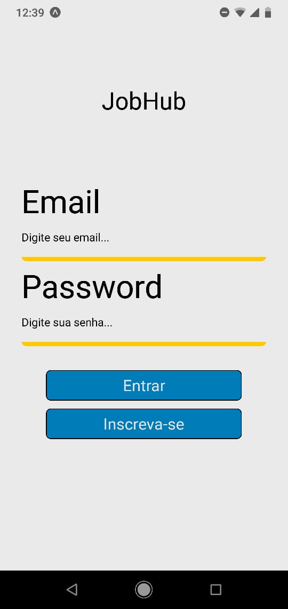
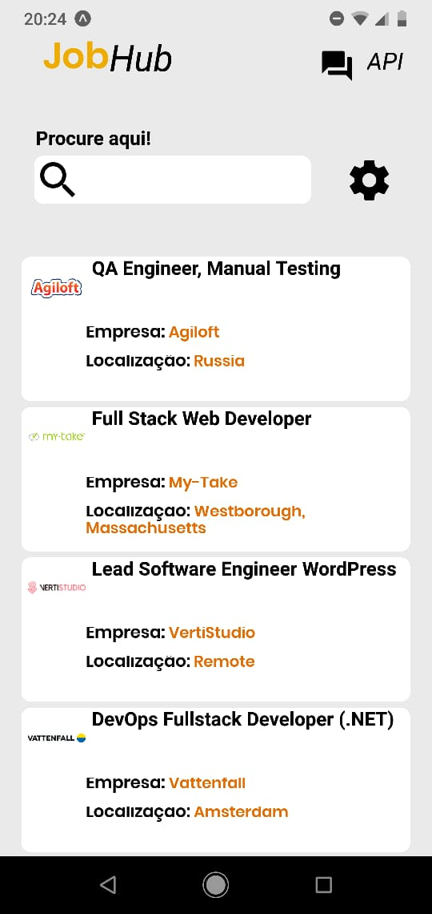
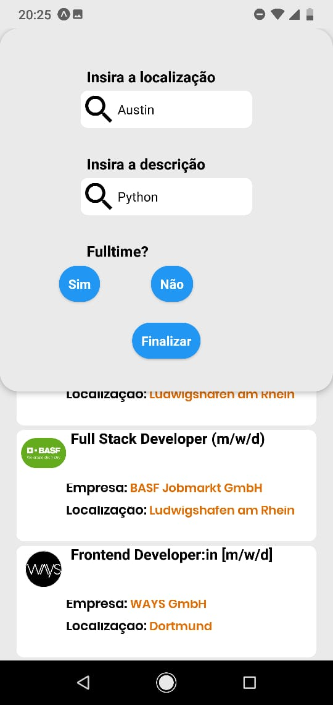
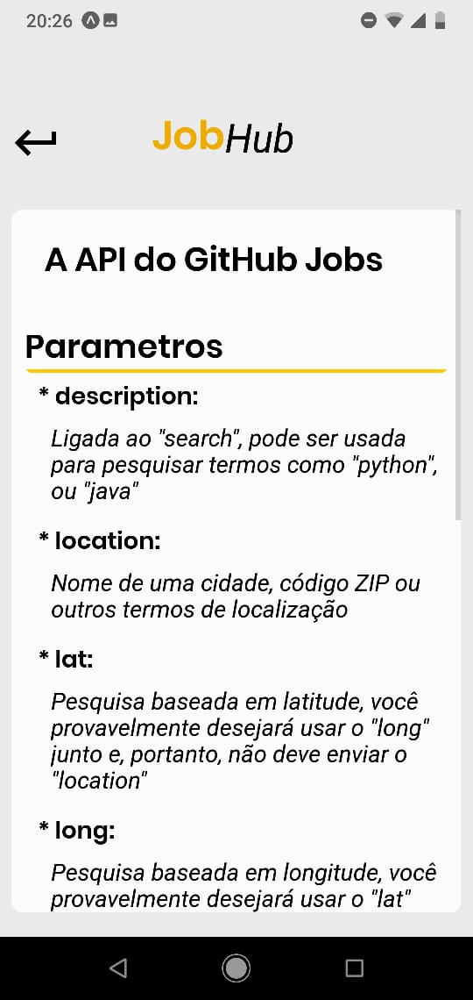

# Paleta de cores
 * #FFC803
 * #FFFFFF
 * #000000
 * #FBFBFB
 * #EAEAEA
 * 007db8
 * #EEAB02

# Observação
    * Template de base escolhido em: https://www.figmacrush.com/job-search-figma-app-template/

# Login

# Home

# Home Search

# Menu Settings

# How It Works?

# API Documentation

